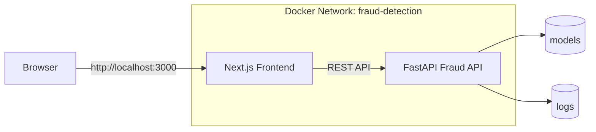

# Docker Deployment Guide

Production-grade container deployment for the Credit Card Fraud Detection platform.


---

## 1) Platform Snapshot

| Service | Role | Port | Container | Image |
| --- | --- | ---: | --- | --- |
| Frontend | Next.js dashboard | `3000` | `fraud-detection-frontend` | `tuta699/credit-card-fraud-detection-frontend:latest` |
| Backend | FastAPI + inference API | `8000` | `fraud-detection-api` | `tuta699/credit-card-fraud-detection:latest` |

---

## 2) Architecture



---

## 3) Quick Start (90 seconds)

### Full stack

```bash
git clone https://github.com/tuta699/credit-card-fraud-detection.git
cd credit-card-fraud-detection
docker compose up -d --build
```

Access points:

- Frontend: <http://localhost:3000>
- API docs: <http://localhost:8000/docs>
- Health: <http://localhost:8000/health>

### Backend only (production compose)

```bash
docker compose -f docker-compose.prod.yml up -d
```

---

## 4) Local Dev Workflow

```bash
make docker-build
make docker-run
make docker-stop
make docker-clean
```

Notes:

- `docker-build` creates backend image tags (`latest` + git SHA).
- `docker-run` mounts `models` and `config` as read-only.
- First build may take longer due to scientific Python packages.

---

## 5) Environment Setup

Create env file:

```bash
cp .env.example .env
```

Recommended production values:

```ini
API_PORT=8000
APP_ENV=production
LOG_LEVEL=INFO

# Security
CORS_ALLOW_ORIGINS=https://your-frontend-domain
ENABLE_RESET_ENDPOINT=false

# Frontend
FRONTEND_PORT=3000
NEXT_PUBLIC_API_URL=http://backend:8000
```

---

## 6) Build and Push to Docker Hub

### Backend image

```bash
docker login
docker build -t tuta699/credit-card-fraud-detection:latest .
docker push tuta699/credit-card-fraud-detection:latest
```

### Frontend image

```bash
docker build -t tuta699/credit-card-fraud-detection-frontend:latest -f frontend/Dockerfile frontend
docker push tuta699/credit-card-fraud-detection-frontend:latest
```

Verify published digest:

```bash
docker pull tuta699/credit-card-fraud-detection:latest
docker inspect tuta699/credit-card-fraud-detection:latest --format='{{index .RepoDigests 0}}'
```

---

## 7) CI/CD Pipeline (GitHub Actions)

Workflow: `.github/workflows/ci-cd.yml`

Pipeline stages:

1. Python test and lint
2. Frontend lockfile validation (`npm ci --ignore-scripts`)
3. Docker Buildx image build (backend + frontend)
4. Deploy notification on `main`

Frontend reliability improvements in CI:

- Explicit Node 20 setup in build job
- GHA cache scopes split by image (`backend`, `frontend`)
- Explicit webpack alias for `@` path resolution in Next config

---

## 8) Security Baseline

Already enabled:

- Non-root container users
- `no-new-privileges`
- Dropped Linux caps (`cap_drop: ALL`)
- Read-only mounts for model and config paths
- Runtime healthchecks

Before internet exposure:

- Set strict `CORS_ALLOW_ORIGINS` (never wildcard)
- Keep `ENABLE_RESET_ENDPOINT=false` in production
- Never commit `.env` or credentials
- Rebuild images regularly to pick up base image patches

---

## 9) Troubleshooting

### A) Docker daemon not running (Windows)

Error:

`open //./pipe/dockerDesktopLinuxEngine: The system cannot find the file specified`

Fix:

1. Start Docker Desktop.
2. Wait until engine is fully running.
3. Validate:

```bash
docker info
```

### B) Frontend image fails in CI: `Module not found: Can't resolve '@/lib/api'`

Checklist:

1. Confirm alias in `frontend/tsconfig.json`:

```json
"baseUrl": ".",
"paths": {
  "@/*": ["./src/*"]
}
```

1. Confirm explicit alias in `frontend/next.config.js`.
2. Re-run workflow after pushing both files.

### C) `npm ci` fails in CI

Cause: lockfile mismatch.

Fix:

```bash
cd frontend
npm install
git add package-lock.json
```

---

## 10) Release Tips for ML Teams

- Keep model artifacts versioned and immutable per release.
- Tag images with both `latest` and semantic tags (example: `v1.3.0`).
- Keep rollback notes with the image digest for each deployment.
- Validate API health and one smoke inference after every rollout.

---

This Docker stack is now optimized for local development, CI reliability, and secure production deployment.
