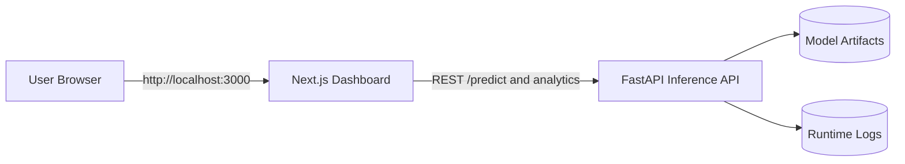

# Credit Card Fraud Detection Platform

Production-ready credit card fraud detection platform with a FastAPI inference backend, Next.js dashboard frontend, and Docker-first deployment workflow.


---

## Overview

This project detects suspicious credit card transactions using machine learning models with engineered features, then serves predictions through a robust API and a modern analytics dashboard.

Core capabilities:

- Real-time fraud prediction via REST API
- Risk scoring and fraud severity categorization
- Transaction analytics and alerting endpoints
- Model explainability hooks and feature importance access
- Containerized full-stack deployment with health checks and security hardening

---

## Architecture



---

## Tech Stack

| Layer | Technology |
| --- | --- |
| Backend API | FastAPI, Uvicorn, Pydantic |
| ML/Data | scikit-learn, XGBoost, LightGBM, imbalanced-learn, SHAP, pandas, numpy |
| Frontend | Next.js 15, React 18, TypeScript, Tailwind CSS |
| DevOps | Docker, Docker Compose, GitHub Actions |

---

## Quick Start

### Option A: Full Stack with Docker (Recommended)

```bash
git clone https://github.com/letera1/Credit-Card-Fraud-Detection.git
cd Credit-Card-Fraud-Detection
docker compose up -d --build
```

Open:

- Frontend: http://localhost:3000
- API docs: http://localhost:8000/docs
- Health check: http://localhost:8000/health

### Option B: Run Locally Without Docker

Backend:

```bash
python -m venv .venv
# Windows PowerShell:
.venv\Scripts\Activate.ps1
# Linux/macOS:
# source .venv/bin/activate

pip install -r requirements.txt
uvicorn src.api.app:app --host 0.0.0.0 --port 8000 --reload
```

Frontend:

```bash
cd frontend
npm install
npm run dev
```

---

## Environment Configuration

Create your environment file from template:

```bash
cp .env.example .env
```

Common settings:

```ini
API_PORT=8000
FRONTEND_PORT=3000
APP_ENV=production
LOG_LEVEL=INFO
CORS_ALLOW_ORIGINS=http://localhost:3000,http://127.0.0.1:3000
ENABLE_RESET_ENDPOINT=false
```

---

## API Highlights

| Endpoint | Method | Description |
| --- | --- | --- |
| /predict | POST | Predict fraud probability and risk score |
| /analytics | GET | Aggregate dashboard metrics |
| /transactions | GET | Recent transaction history |
| /alerts | GET | Active and resolved fraud alerts |
| /alerts/{alert_id}/resolve | POST | Resolve an alert |
| /risk-profile/{user_id} | GET | User-level risk profile summary |
| /model/info | GET | Model metadata and training information |
| /model/feature-importance | GET | Feature importance view |
| /health | GET | Service and model health status |

Example request:

```bash
curl -X POST "http://localhost:8000/predict" \
  -H "Content-Type: application/json" \
  -d '{
    "Time": 10000,
    "V1": 0.1,
    "V2": -0.2,
    "V3": 0.3,
    "V4": -0.1,
    "V5": 0.2,
    "V6": -0.3,
    "V7": 0.1,
    "V8": -0.05,
    "V9": 0.07,
    "V10": -0.11,
    "V11": 0.08,
    "V12": -0.02,
    "V13": 0.03,
    "V14": -0.15,
    "V15": 0.04,
    "V16": -0.09,
    "V17": 0.06,
    "V18": -0.07,
    "V19": 0.12,
    "V20": -0.05,
    "V21": 0.01,
    "V22": -0.08,
    "V23": 0.02,
    "V24": -0.04,
    "V25": 0.03,
    "V26": -0.06,
    "V27": 0.05,
    "V28": -0.01,
    "Scaled_Amount": 0.75
  }'
```

---

## Model Training

Train the advanced model pipeline:

```bash
python train_advanced_model.py
```

The training workflow includes:

- Synthetic fraud/legitimate transaction generation
- Feature engineering and amount scaling
- Imbalance handling with SMOTE + Tomek links
- Ensemble model training (XGBoost, LightGBM, Random Forest)
- Model report generation in reports/model_report.json

Saved artifacts include:

- models/best_fraud_model.pkl
- models/ensemble_models.pkl
- models/feature_names.pkl
- models/amount_scaler.pkl

---

## Docker and Deployment

For full Docker operations, CI details, and production hardening guidance, see:

- [DOCKER_GUIDE.md](DOCKER_GUIDE.md)

Useful commands:

```bash
make docker-build
make docker-run
make docker-stop
make docker-clean
```

---

## Security Notes

Built-in safeguards include:

- Non-root container execution
- Dropped Linux capabilities
- no-new-privileges container option
- Read-only model/config mounts
- Runtime health checks

Before production exposure:

- Restrict CORS_ALLOW_ORIGINS to trusted domains
- Keep ENABLE_RESET_ENDPOINT=false
- Rotate and secure environment secrets

---

## Repository Structure

```text
.
|-- src/                     # Core backend app, pipelines, monitoring, features
|-- frontend/                # Next.js dashboard
|-- models/                  # Trained model artifacts
|-- data/                    # Datasets
|-- config/                  # Runtime config
|-- apis/                    # API compatibility and service wrappers
|-- .github/workflows/       # CI/CD automation
|-- Dockerfile               # Backend container
|-- docker-compose.yml       # Full-stack compose
|-- docker-compose.prod.yml  # Backend-only production compose
|-- train_advanced_model.py  # Advanced model training script
```

---

## CI/CD

GitHub Actions workflow runs:

- Python dependency install and test/lint checks
- Frontend lockfile validation
- Docker image builds for backend and frontend
- Main branch deploy notification stage

---

## License

This project is licensed under the MIT License. See LICENSE for details.
