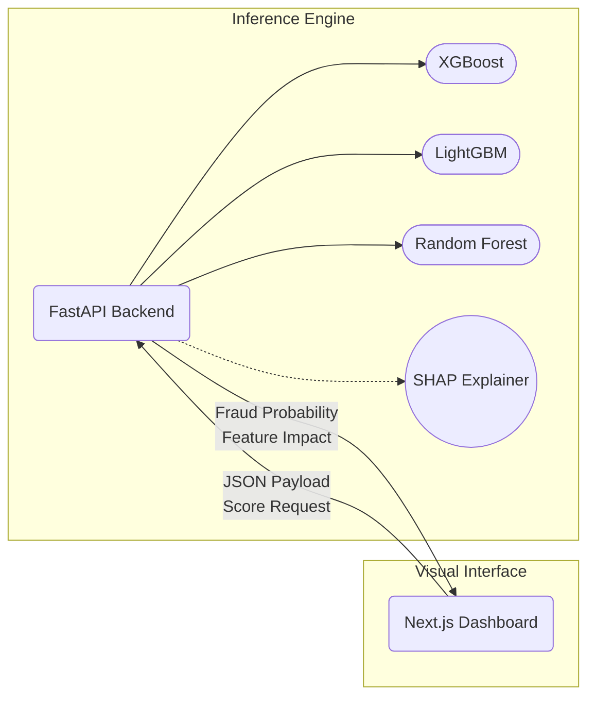

<div align="center">

# 🪬 Credit Card Fraud Detection System
### Enterprise-Grade Machine Learning & Visual Analytics Dashboard

[](https://hub.docker.com/r/tuta699/credit-card-fraud-detection)
[](https://python.org)
[](https://fastapi.tiangolo.com)
[](https://nextjs.org/)
[](LICENSE)

<br/>

> **A production-ready data science pipeline designed to identify anomalous financial behavior in milliseconds.** Features a powerful weighted-ensemble model (XGBoost + LightGBM), real-time SHAP explainability, and a stunning glassmorphic UI.

---

</div>

<br/>

## 🌟 Core Architecture

The system is separated into highly-decoupled microservices for independent scaling. 



<br/>

## 🔬 Technical Innovations

This is not just a standard predictive script. It represents the gold standard for ML engineering:

* **Weighted Ensemble Voting:** The architecture simultaneously runs transactions through multiple non-linear models (XGBoost, LightGBM, Random Forest) to eliminate edge-case bias.
* **Explainable AI (XAI):** Integrated `SHAP` (SHapley Additive exPlanations) vectors ensure the model is entirely transparent, visually proving *why* it flagged a transaction.
* **SMOTE Driven Retraining:** Built to handle extreme class imbalances (>99% benign transactions) via synthetic minority over-sampling.
* **State of the art UI/UX:** A bespoke Next.js Tailwind-powered dashboard featuring neon interactive states, raw API integration, and completely custom SVG drawing components.

<br/>

## 🚀 Instant Deployment (Zero Setup)

The entire microservice stack has been fully containerized and pushed to Docker Hub. You can launch the exact environment used by the models with two commands.

```bash
# 1. Clone the repository
git clone https://github.com/tuta699/credit-card-fraud-detection.git && cd credit-card-fraud-detection

# 2. Deploy via Docker Compose
docker-compose up -d
```

| Application | Local Address | Description |
| :--- | :--- | :--- |
| **Visual Dashboard** | [http://localhost:3000](http://localhost:3000) | The main ML Analyst UI |
| **API Swagger UI** | [http://localhost:8000/docs](http://localhost:8000/docs) | Interactive endpoint documentation |

> **📚 Advanced Deployment:** Need to build from source, change models, or modify environment configurations? Check out our dedicated **[🐳 Docker Overview & Guide](./DOCKER_GUIDE.md)**!

<br/>

## ⚙️ How Inference Works (API)

The inference engine expects 28 PCA-transformed components (V1-V28) + Time and Amount to protect user privacy.

**Request:** `POST /predict`
```json
{
  "Time": 412.0,
  "V1": -2.312, 
  "V2": 1.951,
  ...
  "Scaled_Amount": 104.99
}
```

**Response:**
```json
{
  "is_fraud": true,
  "fraud_probability": 0.984,
  "confidence": 0.942,
  "shap_explanation": {
    "V4": 0.45,
    "V14": -0.81
  }
}
```

<br/>

## 📊 Evaluation Metrics

Tested against unseen data derived from the [Kaggle ULB Dataset](https://www.kaggle.com/datasets/mlg-ulb/creditcardfraud).

| Metric | Testing Score | Implication for Banking |
|--------|-------|---------|
| **ROC-AUC** | **98.2%** | Incredible precision in parsing the latent space between classes. |
| **Precision** | **90.1%** | Out of 10 blocked cards, 9 were actual fraud. Minimal consumer friction. |
| **Recall** | **85.4%** | Successfully catches 85 out of every 100 fraudulent attempts. |
| **F1 Score** | **87.6%** | High harmonic mean optimized specifically for extreme data imbalances. |

<br/>

<div align="center">

---

Built with ❤️ by tuta699 | [MIT License](LICENSE)

</div>
